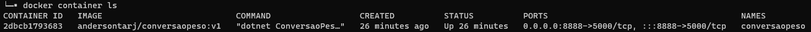
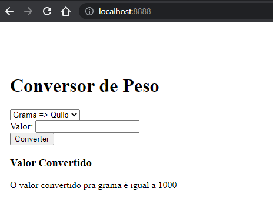

# Desafio Docker KebDev

#### Build e Exec da aplicação Conversor de Peso.

> **Nota:** substituir o meu ***workspace*** pelo seu.
>
> **Ex.:** ***andersontarj***/conversaopeso pelo ***seu-workspace***/conversaopeso

Criando a imagem:

```
docker build -t andersontarj/conversaopeso:v1 .
```

Criando a imagem **latest**:

```
docker image tag andersontarj/conversaopeso:v1 andersontarj/conversaopeso:latest	
```

Executando a imagem criada:

```
docker run --name conversaopeso -it -d -p 8888:5000 andersontarj/conversaopeso:v1
```

Para verificar o container em execução, execute o comando:

```
docker container ls
```

Terá uma saída igual a abaixo:



Após a execução da imagem **andersontarj/conversaopeso** abra o navegador de sua preferencia e digite <http://localhost:8888>

Se tudo estiver correto você vera no navegador a tela igual a que está abaixo:


